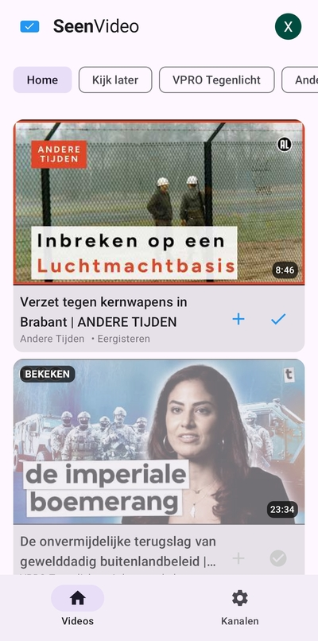
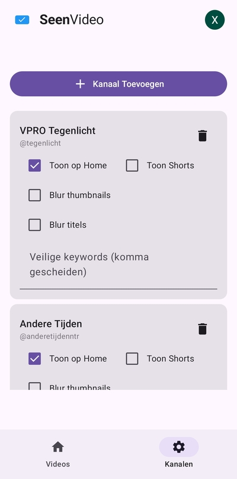
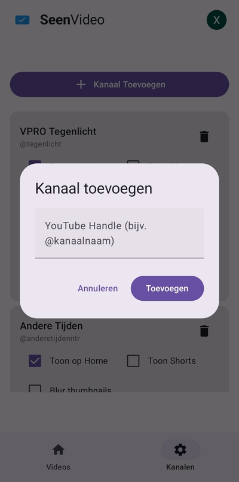

# SeenVideo

SeenVideo is an Android application designed for a focused YouTube experience. It allows users to follow specific channels, manage their "Watch Later" list, and track viewed videos using custom YouTube playlists.


## Previews

<p align="center">
  
  
  
</p>

## Features

*   **Channel Management**: Follow specific YouTube channels by their handle (e.g., `@VPROTegenlicht`).
*   **Focused Home Feed**: Only see videos from the channels you've explicitly added.
*   **Playlist Sync**: 
    *   Synchronizes with a custom YouTube playlist ("SeenVideo Watched") to track your progress across devices.
    *   Directly manage and view your "Watch Later" playlist.
*   **Privacy & Focus Tools**:
    *   **Blur Titles & Thumbnails**: Option to blur video details for specific channels to avoid spoilers or clickbait.
    *   **Keywords Filter**: Highlight specific keywords in video titles.
*   **Material 3 Design**: A clean, modern interface with support for Dark Mode.
*   **Google Identity Integration**: Secure sign-in using the latest Credential Manager API.

## Technical Stack

*   **Language**: [Kotlin](https://kotlinlang.org/)
*   **UI Framework**: [Jetpack Compose](https://developer.android.com/jetpack/compose)
*   **Architecture**: MVVM with Clean Architecture principles.
*   **Dependency Injection**: [Hilt](https://dagger.dev/hilt/)
*   **Local Database**: [Room](https://developer.android.com/training/data-storage/room)
*   **Networking**: [Retrofit](https://square.github.io/retrofit/) & [Gson](https://github.com/google/gson)
*   **Authentication**: [Google Credential Manager](https://developer.android.com/identity/sign-in/credential-manager)
*   **APIs**: [YouTube Data API v3](https://developers.google.com/youtube/v3)
*   **Image Loading**: [Coil](https://coil-kt.github.io/coil/)

## Setup

To build the project locally, you need to provide your own API keys in `local.properties`:

1.  Create a project in the [Google Cloud Console](https://console.cloud.google.com/).
2.  Enable the **YouTube Data API v3**.
3.  Generate an **API Key** and an **OAuth 2.0 Client ID** (Android).
4.  Add the following lines to your `local.properties` file in the project root:

```properties
YOUTUBE_API_KEY=YOUR_API_KEY_HERE
GOOGLE_CLIENT_ID=YOUR_CLIENT_ID_HERE.apps.googleusercontent.com
```

## License

This project is licensed under the MIT License - see the [LICENSE](LICENSE) file for details.

## Privacy Policy & Terms

*   [Privacy Policy](PRIVACY_POLICY.md)
*   [Terms of Service](TERMS_OF_SERVICE.md)
